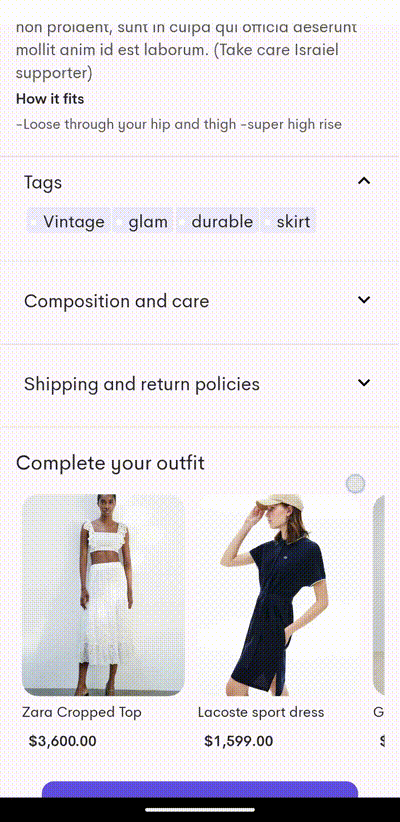

# Akhein-App
AKHEINApp allows users to write and save diary entries with the option to include photos and expressive emojis to capture the essence of each moment. 

 &nbsp;&nbsp;&nbsp;
 &nbsp;&nbsp;&nbsp;   
 &nbsp;&nbsp;&nbsp; 

Here's an overview of the app's features:
- **Market Feature**: The Market section is divided into four main categories: Featured, Collection, Stores, and Tags.

- **Profile Feature**: The Profile section contains essential user information and settings. It displays the user's profile name, username, and offers access to manage preferences, cards, and addresses. Users can update their personal details and control various aspects of their account

- **Authentication Feature**: This feature handles user authentication, allowing users to sign in and create accounts securely. The app uses a secure authentication mechanism to ensure users can access their profiles and personalize their shopping experience.

- **Feed Feature**: The Feed section displays a variety of stores to users, enabling easy access to view and explore different store offerings. Each store can be selected, leading to a detailed view of its products. The bottom navigation allows users to quickly switch between the Feed, Market, and Profile sections.

- **Purchase Flow Feature**:The app provides a seamless and intuitive purchase process to ensure a smooth shopping experience for users. The flow includes the following steps:

Add to Cart:
Users can browse products and add their desired items to the cart. This is the first step towards completing a purchase.

Cart Overview:
Once products are in the cart, users can review their selected items by navigating to the cart. The cart displays all chosen products, allowing users to make adjustments, such as changing quantities or removing items. When ready, users can click the "Continue to Checkout" button.

Select or Add Address:
After proceeding from the cart, users must either select a previously saved shipping address or add a new one. This ensures that products are shipped to the correct location.

Final Order Summary:
Once the address is confirmed, users are taken to the final page. This summary page displays:

The items selected for purchase
The subtotal of the products
The shipping price based on the selected shipping method
The total amount (subtotal + shipping)
Confirm and Pay:
At the final stage, users can confirm their order and proceed to payment. After confirming the details, they click "Confirm and Pay" to complete the transaction. Payment is processed securely to ensure user safety and privacy.

### Navigation
The app has :three: screen destinations which use Compose Navigation to manage navigation.

| :feature:Feed&Profile               | :flow:Purhcase Flow                 | :feature:Search&Cart                |
|-------------------------------------|-------------------------------------|-------------------------------------|
|  |  |  |

| :feature:Featues&Collection    | :flow:Tags&Stores                          | :feature:Search&Cart                |
|--------------------------------|--------------------------------------------|-------------------------------------|
|  |  |  |

- **Authentication Feature**: This feature focuses on user authentication and validation. It utilizes Google Sign-In to ensure that users can securely access their diary entries. By authenticating users, the app guarantees that only authorized individuals can interact with their personal diaries.

- **Home Feature**: The Home feature is responsible for displaying and filtering diary entries based on the date. It provides a user-friendly interface to navigate through diary entries and quickly filter diaries by specific dates. Additional selections can be accessed through the Navigation Drawer.

- **Write Feature**: The Write feature enables users to create new diary entries or modify existing ones. It offers a seamless and intuitive interface for users to capture and document their thoughts, moments, and memories. DiaryApp empowers the users to personalize content by adding emojis and accompanying images

# :memo: Contributor :memo:
- [@fatmaa2003](https://github.com/fatmaa2003)
- [@nadashahe](https://github.com/nadashahe)
- [@sheehata](https://github.com/sheehata)
- [@hanann03](https://github.com/hanann03)
- [@mostafat754](https://github.com/mostafat754)